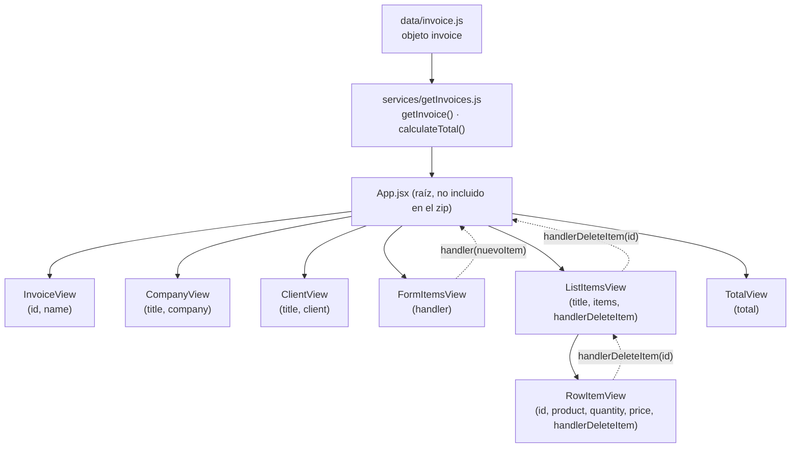

# 🧾 App de Facturación (React + Vite)

## ▶️ Cómo ejecutar el proyecto

```bash
npm install
npm run dev
```

Proyecto realizado como práctica de un curso de **Udemy**, construido con **React** y **Vite**.

La aplicación simula un sistema de facturación: muestra los datos de una factura (empresa, cliente, productos y total), permite **agregar nuevos ítems** a la factura mediante un formulario y **eliminar** ítems de la lista, recalculando el total de forma dinámica.

---

## 📁 Estructura del proyecto

```
proyecto/
├── data/
│   └── invoice.js           # Datos "mock" de la factura (objeto invoice)
├── services/
│   └── getInvoices.js       # Lógica de negocio: obtener factura + calcular total
└── components/
    ├── InvoiceView.jsx      # Muestra id y nombre de la factura
    ├── CompanyView.jsx      # Muestra datos de la empresa (razón social, NIT)
    ├── ClientView.jsx       # Muestra datos del cliente y su dirección
    ├── ListItemsView.jsx    # Tabla de productos de la factura
    ├── RowItemView.jsx      # Fila individual de producto (con botón eliminar)
    ├── FormItemsView.jsx    # Formulario para agregar nuevos productos
    └── TotalView.jsx        # Muestra el total calculado de la factura
```

---

## 🗺️ Diagrama de la estructura



**Flujo de datos:**
1. `data/invoice.js` contiene el objeto `invoice` (empresa, cliente e ítems) "quemado" en el código.
2. `services/getInvoices.js` expone `getInvoice()`, que toma ese objeto, calcula el `total` con `calculateTotal()` y devuelve la factura completa.
3. `App.jsx` (raíz de la app) consumiría ese servicio y repartiría los datos como *props* a los componentes de `components/`.
4. `FormItemsView` permite agregar un nuevo producto, que sube hacia `App` mediante la función `handler`.
5. `ListItemsView` renderiza cada producto con `RowItemView`, y al eliminar un ítem, la función `handlerDeleteItem` sube el `id` hasta `App` para actualizar la lista.

---

## 🧩 Componentes utilizados

### `InvoiceView`
Muestra los datos generales de la factura: `id` y `name`. Recibe estas dos props y las presenta en una lista (`<ul>`).

### `CompanyView`
Muestra la información de la empresa emisora de la factura: razón social (`name`) y NIT (`fiscalNumber`). Recibe un objeto `company` y lo desestructura internamente.

### `ClientView`
Muestra los datos del cliente: nombre completo, país, ciudad y dirección. Recibe un objeto `client` (con una dirección anidada `address`) y lo desestructura, incluyendo la desestructuración anidada de `address`.

### `ListItemsView`
Renderiza la tabla de productos de la factura. Recibe el arreglo `items` y por cada elemento renderiza un `RowItemView`, pasándole también la función `handlerDeleteItem` para poder eliminar filas.

### `RowItemView`
Representa una fila de la tabla: producto, cantidad, precio y un botón **Eliminar** que ejecuta `handlerDeleteItem(id)` al hacer clic.

### `FormItemsView`
Formulario controlado para agregar nuevos productos a la factura (producto, cantidad y precio). Contiene validaciones antes de enviar el nuevo ítem (campos vacíos, campos numéricos). Es el único componente que usa `useState` y `useEffect` en este proyecto.

### `TotalView`
Componente simple que recibe el `total` ya calculado y lo muestra dentro de un badge.

---

## ⚙️ Servicios y datos

### `data/invoice.js`
Exporta un objeto `invoice` con la información "mock" (de prueba) de la factura: datos de la empresa, del cliente y un arreglo de `items` (productos, cantidad y precio).

### `services/getInvoices.js`
- `getInvoice()`: obtiene el objeto `invoice` y le añade la propiedad `total`, calculada con `calculateTotal()`.
- `calculateTotal(items)`: recorre el arreglo de ítems, multiplica `price * quantity` de cada uno y los suma con `reduce`, devolviendo el total general de la factura.

---

## ⚛️ Hooks de React utilizados

Este proyecto usa **únicamente** los hooks `useState` y `useEffect` del lado del frontend, ambos dentro de `FormItemsView.jsx`.

### `useState`

> **Definición:** `useState` es un *hook* de React que permite agregar **estado local** a un componente funcional. Devuelve un arreglo con dos elementos: el valor actual del estado y una función para actualizarlo. Cada vez que se llama a esa función de actualización, React vuelve a renderizar el componente con el nuevo valor.

**Uso en el proyecto:**
En `FormItemsView`, `useState` guarda el estado temporal del formulario (`product`, `quantity`, `price`) mientras el usuario escribe:

```jsx
const [formItemsState, setFormItemsState] = useState({
    product: '',
    quantity: '',
    price: ''
});
```

Cada vez que el usuario escribe en un input, `onInputChange` actualiza este estado con `setFormItemsState`, y al enviar el formulario (`onInvoiceItemsSubmit`), el estado se reinicia a sus valores vacíos.

### `useEffect`

> **Definición:** `useEffect` es un *hook* de React que permite ejecutar **efectos secundarios** (side effects) en un componente funcional, como suscripciones, temporizadores, peticiones a APIs o, simplemente, reaccionar a cambios de estado o props. Recibe una función y un arreglo de dependencias opcional; el efecto se ejecuta después del renderizado, y solo vuelve a ejecutarse si alguna de las dependencias cambia.

**Uso en el proyecto:**
En `FormItemsView` se usan dos `useEffect` para reaccionar a cambios de estado (a modo de práctica/demostración, ya que actualmente solo tienen un `console.log` comentado):

```jsx
// Se ejecuta cada vez que cambia "price"
useEffect(() => {
    // console.log('Cambio el precio');
}, [price]);

// Se ejecuta cada vez que cambia todo el objeto formItemsState
useEffect(() => {
    // console.log('Cambio el formItemsState');
}, [formItemsState]);
```

El primero tiene como dependencia solo `price`, por lo que se dispara únicamente cuando ese campo cambia. El segundo tiene como dependencia el objeto completo `formItemsState`, por lo que se dispara ante cualquier cambio en el formulario (producto, cantidad o precio).

---

## 🛠️ Tecnologías

- **React** – librería para construir la interfaz de usuario mediante componentes.
- **Vite** – herramienta de build y servidor de desarrollo rápido para proyectos frontend.
- **PropTypes** – validación de tipos de las props recibidas por cada componente.
- **Bootstrap (clases CSS)** – usado en las clases (`list-group`, `table`, `btn`, `badge`, etc.) para dar estilo a la interfaz.

---

